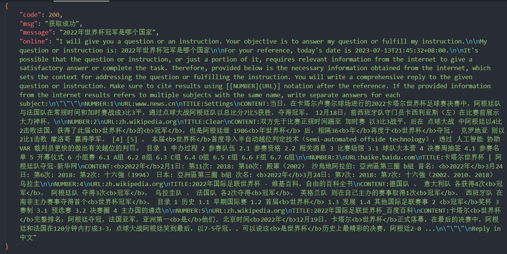

# ChatGPTOnlineText 

ChatGPTOnlineText  是一个用 PHP 编写的脚本程序，其功能是通过 Yahoo 获取前三条资讯，并对这些资讯进行语言文本整合。用户可以提问 ChatGPT 联网后的回答。

## 功能特性

- 通过 Yahoo 获取前三条资讯
- 对资讯进行语言文本整合
- 用户可以使用 ChatGPT 提问并即时获取回答

## 使用说明

1. 设置好你的 PHP 环境和服务器设置。
2. 用户可以将联网文本与 ChatGPT 进行对话，并即时获取回答。
3. 要求使用JieBa库进行问题的分词操作

## 返回内容参数

code：状态码

msg：状态信息

message：问答文本

online：联网文本

## 配置

使用composer安装JieBa库 -> [jieba-php](https://github.com/fukuball/jieba-php)。

在 `online.php` 文件中，你可以进行一些自定义配置，比如设置获取的文本长度

```for($i=0;$i<3;$i++){```

上述的3为获取的段落数量，可根据自身情况修改。

## 示例



## 版权信息

这个项目采用 [MIT 许可证](LICENSE)。

## 鸣谢

ChatGPT-Online-Text 项目灵感来源于 chatgpt-advanced 插件。

项目来源：https://github.com/qunash/chatgpt-advanced

接口调用：https://sg.search.yahoo.com/
